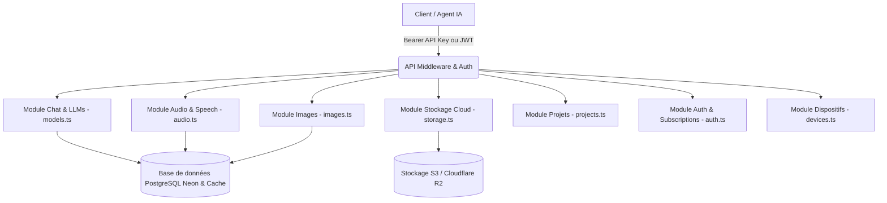

# Guide Exhaustif de l'API mAI pour Agents IA Autonomes (LLMs & Multi-Agents) 🚀🤖

> **Document de référence technique et d'intégration pour Agents IA**  
> Ce document décrit les spécifications exhaustives de l'ensemble des routes de l'API mAI (`https://mdevslabs--01a03d93d1b372e9b1fcba5dbfb23c3c.web.val.run`, `https://mai.val.run` ou base locale `/api`), leurs protocoles de communication multi-modèles (OpenAI, Anthropic, Google Gemini), les quotas, schémas de données et règles de sécurité.

---

## 📑 Sommaire

1. [Architecture Globale & Modules de l'API](#1-architecture-globale--modules-de-lapi)
2. [Authentification, En-têtes & Forfaits](#2-authentification-en-têtes--forfaits)
3. [Catalogue Audio & Synthèse Vocale (Speech / TTS)](#3-catalogue-audio--synthèse-vocale-speech--tts)
4. [Catalogue de Génération d'Images](#4-catalogue-de-génération-dimages)
5. [Inférence Multi-Format (OpenAI, Anthropic, Google Gemini)](#5-inférence-multi-format-openai-anthropic-google-gemini)
6. [Gestion du Stockage Cloud mAI](#6-gestion-du-stockage-cloud-mai)
7. [Gestion des Projets & Espaces de Travail](#7-gestion-des-projets--espaces-de-travail)
8. [Authentification, Souscriptions & Clés API](#8-authentification-souscriptions--clés-api)
9. [Gestion des Dispositifs & Sessions Connectées](#9-gestion-des-dispositifs--sessions-connectées)
10. [Exemples d'Intégration pour Agents IA (TypeScript, Python, cURL)](#10-exemples-dintégration-pour-agents-ia-typescript-python-curl)
11. [Codes d'Erreurs & Bonnes Pratiques](#11-codes-derreurs--bonnes-pratiques)

---

## 1. Architecture Globale & Modules de l'API

L'API unifiée mAI est structurée en micro-modules spécialisés :



---

## 2. Authentification, En-têtes & Forfaits

### En-têtes HTTP Requis

| En-tête | Format | Description |
| :--- | :--- | :--- |
| `Authorization` | `Bearer mp-xxxx` ou `Bearer <JWT>` | **Recommandé** : Clé API utilisateur ou token de session |
| `x-api-key` | `string` | Clé API alternative (pour compatibilité) |
| `x-user-id` | `string` | Identifiant secondaire (ID, username ou email) |
| `Content-Type` | `application/json` | Requis pour toutes les requêtes POST / PUT / PATCH |

### Matrice des Forfaits (Tiers) & Quotas

| Métrique | Free | Plus | Pro | Max |
| :--- | :--- | :--- | :--- | :--- |
| **Tokens Textes / Semaine** | 2 000 000 | 50 000 000 | 100 000 000 | Illimité |
| **Tokens Vocaux (Speech) / Semaine** | 500 000 | 50 000 000 | 100 000 000 | Illimité |
| **Générations d'Images / Jour** | 1 image | 5 images | 20 images | 50 images |
| **Stockage Cloud** | 50 Mo | 2 Go | 10 Go | 50 Go |
| **Accès aux Modèles** | Modèles `:free` | Tous modèles | Tous modèles + Priorité | Tous modèles + Priorité Maximale |

---

## 3. Catalogue Audio & Synthèse Vocale (Speech / TTS)

### A. Consultation de l'Usage Vocal (`GET /v1/audio/usage` ou `GET /v1/speech/usage`)
Retourne l'état précis de consommation vocale hebdomadaire de l'utilisateur.

- **Requête** :
  ```http
  GET /v1/audio/usage HTTP/1.1
  Host: mai.val.run
  Authorization: Bearer mp-votrecleapi
  ```
- **Réponse Succès (200 OK)** :
  ```json
  {
    "plan": "Plus",
    "requestsCount": 3,
    "resetAt": "2026-08-31T00:00:00.000Z",
    "tokensUsed": 6,
    "userId": "1",
    "weekStart": "2026-08-24",
    "weeklyLimit": 50000000
  }
  ```

### B. Catalogue des Voix Disponibles (`GET /v1/audio/voices`)
Retourne toutes les voix configurables pour la génération vocale.

- **Réponse Succès (200 OK)** :
  ```json
  {
    "voices": [
      {
        "id": "flux-alexis-en",
        "name": "Alexis (Voix par défaut)",
        "language": "fr",
        "gender": "neutral",
        "preview_url": "https://..."
      }
    ],
    "object": "list"
  }
  ```

### C. Catalogue des Modèles Audio (`GET /v1/audio/models`)
- `deepgram/flux-tts:free` (Modèle haute performance par défaut)

### D. Génération Audio (`POST /v1/audio/speech` ou `POST /v1/speech`)
Génère un flux binaire audio MP3 / AAC ou renvoie l'URL du fichier généré.

- **Corps de la requête (JSON)** :
  ```json
  {
    "input": "Bonjour, ceci est un test de synthèse vocale pour mon agent IA.",
    "model": "deepgram/flux-tts:free",
    "voice": "flux-alexis-en",
    "response_format": "mp3",
    "speed": 1.0
  }
  ```

---

## 4. Catalogue de Génération d'Images

### A. Consultation du Quota Journalier (`GET /v1/images/usage`)
- **Réponse (200 OK)** :
  ```json
  {
    "dailyLimit": 5,
    "plan": "Plus",
    "resetAt": "2026-08-27T00:00:00.000Z",
    "usedToday": 0,
    "userId": "1"
  }
  ```

### B. Génération d'Images (`POST /v1/images/generations` ou `POST /v1/images`)
Compatible avec les formats standards OpenAI DALL-E et Comet.

- **Corps de la requête (JSON)** :
  ```json
  {
    "prompt": "Un paysage futuriste avec une ville flottante cyberpunk, éclairage néon, 8k, photoréaliste",
    "model": "black-forest-labs/flux-1-schnell",
    "n": 1,
    "size": "1024x1024",
    "response_format": "url"
  }
  ```
- **Réponse (200 OK)** :
  ```json
  {
    "created": 1755936000,
    "data": [
      {
        "url": "https://s3.z1storage.com/mai-storage-1/image-xxxx.webp"
      }
    ]
  }
  ```

---

## 5. Inférence Multi-Format (OpenAI, Anthropic, Google Gemini)

### A. Format Standard OpenAI (`POST /v1/chat/completions`)
```http
POST /v1/chat/completions HTTP/1.1
Host: mai.val.run
Authorization: Bearer mp-votrecleapi
Content-Type: application/json

{
  "model": "mDevsLabs/mAI-1.5-Apex",
  "messages": [
    { "role": "system", "content": "Tu es un agent expert en architecture logicielle." },
    { "role": "user", "content": "Présente une architecture microservices résiliente." }
  ],
  "temperature": 0.7,
  "stream": false
}
```

### B. Format Anthropic Messages (`POST /v1/messages`)
```http
POST /v1/messages HTTP/1.1
Host: mai.val.run
Authorization: Bearer mp-votrecleapi
Content-Type: application/json

{
  "model": "poolside/laguna-xs-2.1:free",
  "max_tokens": 2048,
  "messages": [
    { "role": "user", "content": "Génère un contrat OpenAPI 3.0." }
  ]
}
```

### C. Format Google Gemini (`POST /v1beta/models/:model:generateContent`)
```http
POST /v1beta/models/google-gemini-2.5-flash:generateContent HTTP/1.1
Host: mai.val.run
Authorization: Bearer mp-votrecleapi
Content-Type: application/json

{
  "contents": [
    { "role": "user", "parts": [{ "text": "Explique les bases de données vectorielles." }] }
  ]
}
```

---

## 6. Gestion du Stockage Cloud mAI

| Endpoint | Méthode | Rôle |
| :--- | :---: | :--- |
| **`/cloud/storage`** (ou `/v1/cloud/storage`, `/storage`) | `GET` | Statut de l'espace de stockage et quota du compte |
| **`/cloud/files`** (ou `/v1/cloud/files`, `/files`) | `GET` | Liste des fichiers sauvegardés dans le Cloud |
| **`/cloud/upload`** | `POST` | Téléversement d'un document ou média (`multipart/form-data`) |
| **`/cloud/download/:id`** | `GET` | Téléchargement direct ou redirection sécurisée vers le fichier |
| **`/cloud/delete/:id`** | `DELETE` | Suppression d'un fichier et décrémentation automatique du quota |
| **`/cloud/rename/:id`** | `PATCH` | Renommage du fichier `{ "newName": "nouveau_nom.pdf" }` |

#### Exemple de Réponse `GET /cloud/storage` :
```json
{
  "bytes_limit": 2147483648,
  "bytes_used": 1542890,
  "files_count": 4,
  "over_limit": false,
  "percent_used": 0.07,
  "tier": "Plus"
}
```

---

## 7. Gestion des Projets & Espaces de Travail

- `GET /v1/projects` : Liste tous les projets et espaces organisés.
- `POST /v1/projects` : Crée un nouvel espace thématique `{ "name": "...", "description": "...", "icon": "folder", "color": "#6366f1", "instructions": "..." }`.
- `GET /v1/projects/:id` : Récupère les instructions et discussions d'un projet.
- `PUT /v1/projects/:id` : Met à jour la configuration d'un projet.
- `DELETE /v1/projects/:id` : Supprime un projet personnalisé.

---

## 8. Authentification, Souscriptions & Clés API

### A. Déblocage d'un Abonnement (`POST /verify-code`)
Permet à l'agent de débloquer instantanément un forfait (Plus, Pro, Max) pour l'utilisateur via un code d'activation.

- **Requête** :
  ```json
  {
    "code": "MAI-PLUS-XXXXX"
  }
  ```
- **Réponse Succès (200 OK)** :
  ```json
  {
    "message": "Félicitations ! Votre compte est maintenant surclassé au forfait Plus.",
    "success": true,
    "tier": "Plus",
    "token": "eyJhbGciOi..."
  }
  ```

### B. Liste des Clés API du Compte (`GET /api-keys`)
Retourne l'ensemble des clés API enregistrées avec leur compteur de requêtes et date de dernière utilisation.

---

## 9. Gestion des Dispositifs & Sessions Connectées

- `GET /v1/devices` : Retourne la liste des sessions actives (navigateur, OS, adresse IP, date de connexion).
- `DELETE /v1/devices/others` : Révoque toutes les autres sessions ouvertes pour sécuriser le compte.
- `DELETE /v1/devices/:id` : Révoque une session spécifique.

---

## 10. Exemples d'Intégration pour Agents IA

### Exemple TypeScript / Node.js (Client Complet)

```typescript
import OpenAI from "openai";

const client = new OpenAI({
  baseURL: "https://mdevslabs--01a03d93d1b372e9b1fcba5dbfb23c3c.web.val.run/v1",
  apiKey: process.env.MAI_API_KEY, // mp-xxxxxxxx
});

async function main() {
  // 1. Chat Completion
  const response = await client.chat.completions.create({
    model: "mDevsLabs/mAI-1.5-Apex",
    messages: [{ role: "user", content: "Bonjour mAI !" }],
  });
  console.log("IA:", response.choices[0].message.content);

  // 2. Vérification des Quotas Audio
  const usageRes = await fetch("https://mdevslabs--01a03d93d1b372e9b1fcba5dbfb23c3c.web.val.run/v1/audio/usage", {
    headers: { Authorization: `Bearer ${process.env.MAI_API_KEY}` },
  });
  const usage = await usageRes.json();
  console.log("Usage Vocal :", usage);
}

main();
```

### Exemple Python

```python
import os
import requests
from openai import OpenAI

client = OpenAI(
    base_url="https://mdevslabs--01a03d93d1b372e9b1fcba5dbfb23c3c.web.val.run/v1",
    api_key=os.environ.get("MAI_API_KEY")
)

# Inférence LLM
completion = client.chat.completions.create(
    model="mDevsLabs/mAI-1.5-Apex",
    messages=[{"role": "user", "content": "Génère un script d'automatisation."}]
)
print(completion.choices[0].message.content)

# Consultation du Stockage Cloud
storage_res = requests.get(
    "https://mdevslabs--01a03d93d1b372e9b1fcba5dbfb23c3c.web.val.run/cloud/storage",
    headers={"Authorization": f"Bearer {os.environ.get('MAI_API_KEY')}"}
)
print("Stockage:", storage_res.json())
```

---

## 11. Codes d'Erreurs & Bonnes Pratiques

| Code HTTP | Description | Action Recommandée pour l'Agent |
| :--- | :--- | :--- |
| **`401 Unauthorized`** | Clé API invalide ou absente | Vérifier la présence du préfixe `Bearer mp-...` dans l'en-tête `Authorization`. |
| **`403 Forbidden`** | Modèle ou fonctionnalité réservé à un forfait supérieur | Basculer vers un modèle gratuit (`:free`) ou surclasser le compte via un code de déblocage. |
| **`429 Too Many Requests`** | Quota hebdomadaire/journalier dépassé | Attendre la réinitialisation indiquée dans le champ `resetAt` de l'endpoint d'usage. |
| **`500 Internal Server Error`** | Erreur interne du fournisseur amont | Activer automatiquement le mécanisme de repli (fallback) vers un autre modèle compatible. |
